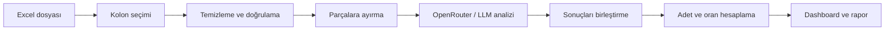
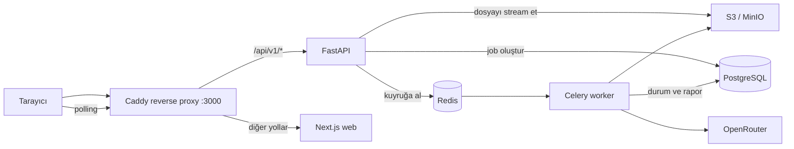

# AUZEF Chat Analiz

AUZEF Chat Analiz, büyük hacimli kullanıcı mesajlarında tekrar eden soruları ve ana konuları yapay zekâ desteğiyle ortaya çıkarmayı amaçlayan bir analiz uygulamasıdır.

Projenin ilk kullanım senaryosu, AUZEF chatbot mesajlarından gerçek kullanıcı ifadelerine dayalı sık sorulan sorular (SSS/FAQ) çıkarmaktır. Uygulama; Excel dosyasındaki mesajları temizlemeyi, benzer soruları gruplamayı, konu dağılımlarını hesaplamayı ve sonuçları anlaşılır bir dashboard üzerinde sunmayı hedefler.

> **Proje durumu:** MVP akışı uçtan uca çalışıyor. `docker compose up` ile sekiz
> uzun ömürlü servis (`proxy`, `web`, `api`, `worker`, `beat`, `postgres`,
> `redis`, `minio`) ve tek seferlik `migrate`
> ayağa kalkar; tarayıcıdan yüklenen bir `.xlsx` profillenir, kolon seçilir,
> analiz OpenRouter üzerinden koşar ve rapor dashboard'da görüntülenip xlsx/JSON
> olarak dışa aktarılır. Job durumu, iptal, maliyet tavanı, PII redaksiyonu ve
> retention süpürücüsü de yerinde.
>
> Uçtan uca akış gerçek bir tarayıcıda test ediliyor (`tests/e2e/`), aynı
> origin'i Caddy tabanlı bir reverse proxy sağlıyor ve 130 MB'lık gerçek bir
> dosyayla yük testi yapılmış durumda: [raporu](docs/yuk-testi.md) ÜÇ kusur
> ortaya çıkardı ve üçü de düzeltildi — o boyuttaki dosyalar önceden hiç
> işlenemiyordu. Kalan maddeler
> [Açık işler ve bilinen sınırlar](#açık-işler-ve-bilinen-sınırlar) bölümünde.

## Neden bu proje?

Binlerce chatbot mesajını manuel olarak incelemek hem zaman alır hem de tekrar eden ihtiyaçların gözden kaçmasına neden olabilir. Bu proje, dağınık mesaj verisini aşağıdaki sorulara yanıt veren ölçülebilir bir rapora dönüştürmeyi amaçlar:

- Kullanıcılar en çok hangi soruları soruyor?
- Hangi konular daha sık gündeme geliyor?
- Bir soru veya tema toplam mesajların ne kadarını oluşturuyor?
- Chatbot bilgi tabanında hangi içerikler iyileştirilmeli?
- Zaman içinde kullanıcı ihtiyaçları nasıl değişiyor?

## Hedeflenen MVP akışı

1. Kullanıcı `.xlsx` formatındaki veri dosyasını yükler.
2. Dosyadaki kolonlar algılanır; metin kolonu ve istenirse session/rol/sıra eşlemesi seçilir.
3. OpenRouter API anahtarı güvenli biçimde backend'e iletilir; sürümlü sistem promptu backend tarafından yönetilir.
4. Boş, geçersiz veya analiz dışı kayıtlar temizlenir.
5. Büyük veri kümeleri modelin bağlam sınırlarına uygun parçalara ayrılır.
6. Mesajlar OpenRouter üzerinden seçilen dil modeline gönderilir.
7. Benzer sorular ve temalar birleştirilir; adet ve oranlar uygulama tarafından hesaplanır.
8. Sonuçlar dashboard ve özet rapor olarak gösterilir.



## Planlanan çıktılar

Dashboard üzerinde aşağıdaki bilgilerin sunulması planlanmaktadır:

- En sık sorulan sorular
- Ana konu ve tema grupları
- Her soru veya temanın tekrar adedi
- Toplam mesajlar içindeki yüzdesi
- Temaları temsil eden örnek kullanıcı mesajları
- Genel analiz özeti
- Toplam, işlenen, elenen ve geçersiz kayıt sayıları
- Dışa aktarılabilir FAQ ve analiz raporu

Örnek sonuç:

| Soru / tema                |  Adet |  Oran |
| -------------------------- | ----: | ----: |
| Sınav tarihleri            | 1.240 | %24,8 |
| Ders materyallerine erişim |   860 | %17,2 |
| Harç ve ödeme işlemleri    |   610 | %12,2 |
| Kayıt yenileme             |   480 |  %9,6 |

## Analiz yaklaşımı

LLM doğrudan toplam sayı üretmez. Her temizlenmiş veya benzersiz mesaj kimliğini kanonik bir SSS ya da tema kimliğine eşler. Adet, oran ve kayıt istatistikleri gerçek mesaj frekanslarından backend tarafından deterministik olarak hesaplanır. Böylece modelin sayı uydurma riski azaltılır ve sonuçlar izlenebilir kalır.

Analiz iki aşamalı bir map/reduce yaklaşımı izler:

- Varsayılan `message` modu her mesajı bağımsız işler ve eski isteklerle
  geriye uyumludur.
- `contextual_user_turns` modu yalnız yapılandırılmış hedef kullanıcı
  turn'lerini sayar; güvenli varsayılan yalnız `text` mesajlarıdır.
  `quick_reply` mesajları varsayılan olarak aynı session'daki sınırlı önceki
  kullanıcı bağlamına girer ve kullanıcı isterse hedef türlere eklenebilir.
  Bot yanıtları varsayılan olarak elenir; yalnız kullanıcı açıkça etkinleştirirse
  sayılmayan bağlam olarak modele gönderilir.
  Standart `session_id`, `message_order`, `direction` ve `message_type`
  kolonları bulunduğunda web arayüzü bu güvenli modu otomatik seçer.
  Böylece “ne zaman?” gibi takip mesajları konuşmadan kopmadan
  sınıflandırılırken bot cevapları ve buton seçimleri FAQ frekansını şişirmez.

1. Normalize edilen mesajlar exact hash ile tekilleştirilir; gerçek frekansları korunur.
2. Benzersiz kayıtlar token bütçesine göre parçalara ayrılır.
3. LLM, her kayıt kimliğini bir SSS veya tema kimliğine eşler.
4. Reduce aşaması farklı parçalardaki benzer kategorileri birleştirir.
5. Backend; adet, oran, Top N, özet ve uyarıları hesaplar.
6. Yapılandırılmış sonuç Pydantic/JSON Schema ile doğrulanır.

## Mimari

Yaklaşık 130 MB büyüklüğündeki gerçek Excel dosyalarının tek bir HTTP isteğinde güvenilir biçimde işlenemeyeceği kabul edilmiştir. Bu nedenle MVP, asenkron job/worker mimarisi kullanır. API uzun işlemi kuyruğa alarak `202 Accepted` döndürür; web arayüzü işlem durumunu 2–3 saniyede bir sorgular. İlk sürümde WebSocket veya SSE kullanılmaz.



Tarayıcı yalnızca proxy ile konuşur; `web` servisi portunu yayınlamaz. Aynı
origin kuralını (ADR §2) uygulayan katman budur, Next.js rewrite'ı değil —
gerekçe ve dört kısıt `infra/docker/Caddyfile` içinde.

### Bileşenler

| Bileşen       | Sorumluluk                                                                     |
| ------------- | ------------------------------------------------------------------------------ |
| Caddy proxy   | Tek giriş noktası: aynı origin, gövde tamponlamasız geçiş, anahtar redaksiyonu |
| Next.js web   | Dosya yükleme, sheet/kolon seçimi, ilerleme durumu ve dashboard                |
| FastAPI       | Upload ve analiz API'leri, doğrulama, job oluşturma ve güvenli hata cevapları  |
| Celery worker | Excel profilleme, ön işleme, PII redaksiyonu ve LLM analiz pipeline'ı          |
| PostgreSQL    | Kalıcı job durumu, metadata, maliyet/token bilgisi ve JSONB analiz raporu      |
| Redis         | Celery kuyruğu, kısa süreli lock ve şifreli/TTL süreli OpenRouter anahtarı     |
| S3 / MinIO    | Ham upload ve Parquet ara dosyaları için geçici object storage                 |

### İki aşamalı işlem modeli

**Upload ve profil:** Dosya object storage'a stream edilir; dosya türü ve OOXML yapısı doğrulanır. Sheet, kolon, satır, boş kayıt ve tekrar bilgileri çıkarılarak kullanıcıya seçim yaptırılır.

**Analiz:** Seçilen kolon satır satır okunur. PII maskelenir, mesajlar tekilleştirilir ve LLM ile sınıflandırılır. Sonuçlar backend'de birleştirilip doğrulandıktan sonra PostgreSQL'e rapor olarak kaydedilir.

Planlanan temel job akışı:

```text
queued → validating/preprocessing → analyzing → aggregating → completed
```

Terminal durumlar `failed` ve `cancelled` olarak tanımlanmıştır. Varsayılan analiz hard timeout'u 45 dakikadır ve ortam ayarıyla değiştirilebilir.

### Monorepo klasör yapısı

```text
AUZEF-Chat-Analiz/
├── apps/
│   ├── web/
│   │   ├── src/app/
│   │   ├── src/components/
│   │   ├── src/features/analysis/
│   │   └── src/lib/api/
│   └── backend/
│       ├── pyproject.toml          # uv projesi, ruff/mypy/pytest config
│       ├── alembic/versions/       # şema migration'ları
│       ├── app/api/v1/
│       ├── app/core/               # errors, handlers, tracing, openapi
│       ├── app/domain/
│       ├── app/models/
│       ├── app/schemas/            # Pydantic sözleşme modelleri
│       ├── app/services/
│       ├── app/pipeline/
│       ├── app/workers/
│       ├── app/prompts/faq_analysis/
│       ├── scripts/                # openapi ve fixture üreticileri
│       └── tests/                  # birim + entegrasyon, tek yerde
├── tests/
│   ├── e2e/                        # Playwright: tarayıcıdan tüm yığına
│   └── fixtures/
│       └── contract/               # üretilmiş, iki dilde doğrulanan gövdeler
├── infra/
│   └── docker/                     # api/web Dockerfile'ları + Caddyfile
├── docs/
│   ├── mimari.md                   # ADR-0001
│   ├── adr/0002-api-contract-freeze.md
│   ├── adr/0003-fastapi-production-foundation.md
│   ├── yuk-testi.md                # 130 MB ölçümü (ADR §10 risk 1)
│   └── api/openapi.json            # üretilmiş sözleşme artefaktı
├── docker-compose.yml
├── Makefile
└── README.md
```

Backend API ve Celery worker aynı Python domain/pipeline kodunu paylaşır; ayrı mikroservis kod tabanları oluşturulmaz.

### Kesin veri akışı

```text
Browser
  → POST /uploads
  → FastAPI dosyayı stream ederek object storage'a yazar
  → Celery validate/profile job
  → güvenli .xlsx kontrolü + sheet/kolon/veri profili
  → kullanıcı sheet ve message_text kolonunu seçer
  → POST /analyses + X-OpenRouter-Key
  → API anahtarı AES-GCM ile şifrelenip Redis'e kısa TTL ile yazılır
  → Celery analysis job
  → preprocess + PII redaksiyonu + exact dedupe/frequency
  → token sınırına göre chunk
  → OpenRouter map çağrıları
  → kategori eşleme/reduce
  → backend deterministik adet/oran aggregation
  → Pydantic result validation
  → PostgreSQL JSONB report
  → GET /analyses/{id} polling
  → dashboard + export
```

#### Önemli analiz kararı

LLM doğrudan toplam sayı üretmez. Her temizlenmiş mesaj veya benzersiz mesaj kimliğini bir kanonik SSS ya da tema kimliğine eşler. Nihai adet ve oranları backend, mesajların gerçek frekanslarından deterministik olarak hesaplar. Böylece LLM'in sayı uydurması engellenir.

## Teknoloji yığını

### Frontend

- Next.js App Router, React ve strict TypeScript
- Tailwind CSS ve shadcn/ui
- TanStack Query
- React Hook Form ve Zod
- Grafik kütüphanesi yok: mevcut rapor grafikleri eksen gerektirmeyen orantılı
  çubuklar ve düz HTML ile çiziliyor. Yol haritasındaki zaman serisi grafikleri
  eklenirken bir kütüphane (ör. Recharts) devreye girecek.

### Backend ve veri işleme

- Python ve FastAPI
- Pydantic v2
- SQLAlchemy 2 ve Alembic
- Celery ve Redis
- PostgreSQL
- `openpyxl` (`read_only/data_only`), Polars ve PyArrow
- `httpx` ile OpenRouter entegrasyonu
- S3 uyumlu object storage; geliştirmede MinIO
- `uv` ile Python bağımlılık yönetimi

### Test ve kalite

- pytest ve pytest-asyncio
- Vitest ve React Testing Library
- Playwright
- Ruff, mypy, ESLint ve Prettier
- GitHub Actions

## Yerel geliştirme

### Gereksinimler

- Node.js 22.22.2 veya üstü (`.nvmrc` ile sabitlendi; `nvm use` yeterli).
  Next.js 16 daha eski 22.x sürümlerini desteklemiyor.
- npm
- Backend üzerinde çalışacaksanız [uv](https://docs.astral.sh/uv/)
  (`curl -LsSf https://astral.sh/uv/install.sh | sh`). Python sürümü
  `apps/backend/.python-version` ile sabitlendi.
- Tüm yığını çalıştırmak ve entegrasyon/E2E testleri için Docker ve Docker Compose

### Kurulum

Repoyu klonlayın:

```bash
git clone https://github.com/Emre-Ustundag/AUZEF-Chat-Analiz.git
cd AUZEF-Chat-Analiz
```

Bağımlılıkları yükleyin:

```bash
npm ci                          # frontend
cd apps/backend && uv sync --dev  # backend (isteğe bağlı)
```

veya ikisini birden: `make install`.

Geliştirme sunucusunu başlatın:

```bash
npm run dev
```

Uygulamayı tarayıcıda [http://localhost:3000](http://localhost:3000) adresinden açabilirsiniz.

Backend'i ayrı bir terminalde başlatmak için:

```bash
cd apps/backend
uv run uvicorn app.main:app --reload --port 8000
```

API dokümanı development/test ortamında [http://localhost:8000/docs](http://localhost:8000/docs),
liveness ve readiness kontrolleri sırasıyla `/api/v1/health/live` ve
`/api/v1/health/ready` adreslerindedir. Readiness Postgres, Redis ve object
storage'a gerçekten dokunur (`app/services/readiness.py`); biri cevap
vermezse `503 SERVICE_NOT_READY` döner ve container healthcheck'i de bu uca
bağlıdır. Kontroller `create_app`'e enjekte edilir — testler kendi sahtelerini
geçirebilsin diye varsayılan boştur ve gerçek kontroller yalnızca process
giriş noktasında kayıtlıdır. Backend ortam
değişkenleri ve kalite komutları için [backend README](apps/backend/README.md)
dosyasına bakın.

### Kullanılabilir komutlar

| Komut                  | Açıklama                                                        |
| ---------------------- | --------------------------------------------------------------- |
| `npm run dev`          | Geliştirme sunucusunu başlatır                                  |
| `npm run build`        | Üretim derlemesi oluşturur                                      |
| `npm run start`        | Üretim sunucusunu başlatır                                      |
| `npm run lint`         | ESLint kontrollerini çalıştırır                                 |
| `npm run format`       | Desteklenen dosyaları Prettier ile biçimlendirir                |
| `npm run format:check` | Dosyaların format kurallarına uyduğunu kontrol eder             |
| `npm run typecheck`    | Yol tiplerini üretip TypeScript kontrolü yapar                  |
| `npm test`             | Vitest test paketini çalıştırır                                 |
| `make e2e`             | Playwright, mock backend'e karşı (Docker gerekmez)              |
| `make e2e-stack`       | Playwright, çalışan yığına karşı (`docker compose up -d`)       |
| `make loadtest`        | 130 MB yük testi (ADR §10 risk 1) — çalışan yığın ister         |
| `make contract`        | API sözleşmesi drift kontrolü                                   |
| `make generate`        | `openapi.json` ve sözleşme fixture'larını üretir                |
| `make check`           | CI'ın tamamı (lint + typecheck + test + contract + build + e2e) |

`make help` tüm hedefleri listeler. Bu komutların tamamı her push ve pull
request'te GitHub Actions üzerinde de çalışır (`.github/workflows/ci.yml`).

### API sözleşmesi

Frontend ve backend tek bir sözleşmeyi paylaşır. Kaynak, `apps/backend/`
altındaki Pydantic modelleridir; `docs/api/openapi.json` ve
`tests/fixtures/contract/` bunlardan **üretilir** ve commit edilir. Bu
dosyaları elle düzenlemeyin.

Bir Pydantic modelini değiştirdiyseniz:

```bash
make generate     # artefaktları yeniden üret
make contract     # iki tarafın da uyduğunu doğrula
```

Ayrışma CI'da `contract` job'ıyla yakalanır: Python'un ürettiği örnek
gövdeler frontend'in Zod şemalarıyla, `openapi.json`'daki enum'lar da Zod
enum'larıyla karşılaştırılır. Kararlar ve gerekçeleri
[ADR-0002](docs/adr/0002-api-contract-freeze.md)'de.

> `npm run typecheck` önce `next typegen` çalıştırır. `PageProps` ve
> `RouteContext` gibi yol tiplerini Next üretir; `next dev`, `next build` veya
> `next typegen` çalıştırılmamış temiz bir kopyada TypeScript bu tipleri
> bulamaz ve editörde hata gösterir.

## Docker ile çalıştırma

Tüm yığını production modunda derleyip başlatmak için:

```bash
docker compose up --build
```

Ardından [http://localhost:3000](http://localhost:3000) adresini açın. Bu adres
Caddy'ye ait: `/api/v1/*` FastAPI'ye, geri kalan her şey Next'e gider. Aynı
origin olduğu için ayrı bir adres yapılandırmak ve CORS gerekmez.

Ayağa kalkan servisler:

| Servis     | Rol                                                                    |
| ---------- | ---------------------------------------------------------------------- |
| `proxy`    | Caddy: tek giriş noktası (`:3000`), aynı origin, `/api/v1` yönlendirme |
| `web`      | Next.js arayüzü (port yayınlamaz; yalnızca proxy erişir)               |
| `api`      | FastAPI (`:8000`), upload/analiz uçları ve health kontrolleri          |
| `worker`   | Celery worker: profilleme, ön işleme, LLM pipeline, export             |
| `beat`     | Celery beat: periyodik retention süpürücüsü                            |
| `migrate`  | Tek seferlik `alembic upgrade head`, `api`'den önce koşar              |
| `postgres` | Job durumu, metadata ve JSONB rapor                                    |
| `redis`    | Celery kuyruğu, BYOK secret'ı ve idempotency kayıtları                 |
| `minio`    | S3 uyumlu object storage (ham upload ve ara dosyalar)                  |

Servisleri durdurmak için:

```bash
docker compose down
```

Backend entegrasyon testleri de bu servisleri kullanır: `docker compose up -d`
çalışmadan `pytest` koşarsanız Postgres/Redis/MinIO isteyen testler açık bir
mesajla ATLANIR (bkz. [Açık işler](#açık-işler-ve-bilinen-sınırlar)).

## Güvenlik ve veri gizliliği

Proje gerçek kullanıcı mesajları ve haricî bir LLM servisiyle çalışacağı için aşağıdaki ilkeler MVP mimarisinin parçasıdır:

- Yalnızca `.xlsx` desteklenir; `.xls`, `.xlsm`, makrolu, şifreli veya bozuk dosyalar reddedilir.
- Varsayılan upload sınırı 150 MB, açılmış OOXML tavanı 4 GiB ve satır sınırı 100.000'dir. Upload ve satır sınırı sözleşmede donmuştur; açılmış boyut tavanı ortam ayarıdır (ZIP bomba savunmasının ikincil katmanı — asıl savunma sıkıştırma oranı ve akış sırasında sayan gerçek bayt kontrolüdür).
- OpenRouter anahtarı yalnızca `X-OpenRouter-Key` header'ında taşınır ve loglarda redakte edilir.
- Anahtar PostgreSQL'e yazılmaz; AES-GCM ile şifrelenmiş, kısa ömürlü bir Redis kaydında tutulur ve işlem sonunda silinir.
- Telefon, e-posta, T.C. ve öğrenci numarası gibi bilinen PII desenleri LLM çağrısından önce maskelenir.
- Ham upload ve Parquet ara dosyaları işlem sonunda silinir; kaçak dosyalar için azami 24 saat lifecycle uygulanır.
- Model yalnızca backend whitelist'indeki structured-output destekli seçeneklerden seçilebilir.
- LLM çıktıları Pydantic/JSON Schema ile doğrulanır; sayısal sonuçlar modelden doğrudan kabul edilmez.
- Job başına maliyet sınırı LLM çağrıları başlamadan kontrol edilir.
- Gerçek kurum verisi kullanılmadan önce SSO/erişim kontrolü ve AUZEF veri işleme onayı zorunludur.

Geliştirme sırasında kullanılacak gizli değerler `.env` dosyalarında tutulmalı ve
Git'e eklenmemelidir. Backend ve compose değişkenleri için kökteki `.env.example`,
web uygulaması için `apps/web/.env.example` dosyasına bakın. `.env.example`'da
bilerek bir `OPENROUTER_API_KEY` satırı **yoktur**: model BYOK'tur, anahtar
yalnızca istekle gelir.

Web uygulamasının kullandığı iki değişken:

| Değişken                   | Varsayılan        | Açıklama                                                                      |
| -------------------------- | ----------------- | ----------------------------------------------------------------------------- |
| `NEXT_PUBLIC_API_BASE_URL` | `/api/v1`         | Backend'in taban adresi. `/api/mock/v1` verildiğinde repodaki mock kullanılır |
| `API_ORIGIN`               | `http://api:8000` | `next.config.ts` rewrite'ının hedefi; tarayıcıya değil Next sunucusuna ait    |

Her ikisi de **build zamanında** okunur ve imaj üretildikten sonra runtime'da
değiştirilemez: `NEXT_PUBLIC_` değişkenleri istemci paketine gömülür, `rewrites()`
ise `next build` sırasında değerlendirilip `routes-manifest.json`'a yazılır. Bu
yüzden compose ikisini de build arg olarak geçiriyor:

```bash
docker compose build --build-arg NEXT_PUBLIC_API_BASE_URL=/api/mock/v1
```

> Kod içindeki yedek (`src/lib/api/client.ts`) `/api/mock/v1`'dir: değişken hiç
> tanımlanmadan çalıştırılan bir kopya, boş bir adrese gitmek yerine çalışan bir
> demo sunar. Compose ve `web.Dockerfile` gerçek backend'i (`/api/v1`) gösterir.

### Mock backend

`src/mocks/` ve `src/app/api/mock/` **kalıcıdır**, geçici bir iskele değil.
`NEXT_PUBLIC_API_BASE_URL=/api/mock/v1` ile tüm akış (upload, kolon seçimi,
polling, rapor, export, `Idempotency-Key`) backend, Postgres, Redis ve MinIO
olmadan çalışır. Arayüz üzerinde çalışan biri için en kısa yol budur.

Mock'lar bilerek `/api/mock/v1` altında: Next'te route handler'lar rewrite'lardan
önce eşleşir, aynı yolu paylaşsalardı gerçek backend'i sessizce gölgelerlerdi.

## Yol haritası

### MVP

- [x] Excel dosyası yükleme ve doğrulama
- [x] Metin kolonu algılama ve seçme
- [x] Veri temizleme ve normalizasyon
- [x] Büyük veri kümelerini parçalara ayırma
- [x] OpenRouter entegrasyonu
- [x] Sistem promptu ve analiz ayarları
- [x] Benzer soruları ve temaları gruplama
- [x] Adet ve oran hesaplama
- [x] Analiz dashboard'u
- [x] FAQ ve özet rapor dışa aktarma
- [x] FastAPI temeli, RFC 9457 hata yönetimi ve health endpoint'leri
- [x] İşlem durumu takibi ve iptal
- [x] Celery ve Redis job altyapısı
- [x] PostgreSQL ve object storage entegrasyonu
- [x] PII redaksiyonu ve veri saklama politikaları
- [x] `Idempotency-Key` desteği (ADR-0002 #3)
- [x] Backend ve frontend test altyapısı (pytest + vitest + sözleşme drift kontrolü)
- [x] Uçtan uca (tarayıcı) test altyapısı — Playwright, `tests/e2e/`
- [x] 130 MB'lık gerçek dosyayla yük testi — [rapor](docs/yuk-testi.md)
- [x] Aynı origin reverse proxy (Caddy) ve readiness kontrolleri

### Sonraki faz

- [ ] Instagram yorumlarını toplama
- [ ] Facebook yorumlarını toplama
- [ ] Kanal bazlı analiz
- [ ] Birleşik çok kanallı analiz
- [ ] Tarih aralığına göre karşılaştırma
- [ ] Tema eğilimleri ve dönemsel değişim analizi
- [ ] Kayıtlı analiz geçmişi ve rapor karşılaştırma

Hata bildirimleri ve özellik önerileri için [GitHub Issues](https://github.com/Emre-Ustundag/AUZEF-Chat-Analiz/issues) kullanılabilir.

## Açık işler ve bilinen sınırlar

### 1. Analiz süresi veri boyutuyla doğrusal büyür ve tavanı vardır

Analiz süresi `(chunk sayısı / AUZEF_LLM_MAX_CONCURRENCY) x ~26 saniye`dir.
Chunk süresi üretilen completion token'la belirlendiği için chunk'ı büyütmek
toplam süreyi düşürmez; ölçeklenen tek boyut eşzamanlılıktır.

Gerçek AUZEF dökümüyle ölçüldü (505.442 satır, bağlamsal mod): 59.001
benzersiz kayıt, 492 chunk. Sıralı koşuda ~3,5 saat, varsayılan eşzamanlılık
8 ile **~35 dakika** — 45 dakikalık hard timeout'a sığar ama **payı dardır**.
Belirgin biçimde daha büyük bir veri seti için önce `AUZEF_LLM_MAX_CONCURRENCY`,
sonra `AUZEF_ANALYSIS_TIMEOUT_SECONDS` yükseltilmelidir.

Bağlamsal modda tekilleştirme bilinçli olarak zayıftır: kayıt kimliği hedef
mesajın yanında bağlamı da içerdiği için aynı soru farklı bağlamlarda ayrı
kayıt olur. Aynı dosya `message` modunda 43.816 benzersiz kayıt veriyor.

Süre dolarsa iş `PROVIDER_TIMEOUT` ile kapanır ve **o ana kadar harcanan
OpenRouter parası karşılıksız kalır**: tamamlanmış chunk sonuçları hiçbir yere
yazılmadığı için yeniden deneme sıfırdan başlar. Ara kayıt/devam etme
uygulanmadı.

### 2. Girdi olarak yalnızca `.xlsx` kabul edilir

Kurumdan gelen dökümler CSV ise yükleme öncesinde Excel'e çevrilmelidir; CSV
sözleşmeye uygun bir hatayla reddedilir, sessizce başarısız olmaz.

### 3. Yerelde testlerin bir kısmı sessizce atlanıyor

Postgres/Redis/MinIO kapalıyken entegrasyon testleri `conftest.py` tarafından
açık bir mesajla atlanır ama `pytest` yine de **yeşil** görünür.
`docker compose up -d` olmadan koşan biri entegrasyon regresyonunu göremez.
CI'da sorun yok: `ci.yml` servisleri kaldırdığı için orada tam koşuyor.

### 4. Uçtan uca testin `stack` projesi CI'da koşmuyor

`npm run e2e:mock` her PR'da koşuyor (Docker gerekmez). `npm run e2e:stack`
gerçek yığına karşı koşan projedir ve CI'da devre dışı: imaj derlemesi +
sekiz servis demek ve `backend` job'ı aynı entegrasyonu servislere karşı
zaten ölçüyor. Yerelde `docker compose up -d` sonrası koşulmalı.

### 5. Analiz adımı otomatik uçtan uca testte kapsanmıyor

`stack` projesi upload → profilleme → kolon ekranına kadar gidiyor ve
BİLEREK durup analiz başlatmıyor: o adım gerçek bir OpenRouter çağrısı ve
kullanıcının parası. Arayüz tarafındaki analiz akışı (ilerleme → rapor →
dışa aktarma) mock backend'e karşı kapsanıyor; kapsanmayan şey gerçek bir
LLM koşusunun uçtan uca otomatik doğrulanması.

### 6. Gerçek kurum verisi için ön koşullar

ADR §9: public deployment yapılmaz ve gerçek AUZEF verisi kullanılmadan önce
SSO/erişim kontrolü ile veri işleme onayı zorunludur. Bugünkü kurulumda
kimlik doğrulama YOK — uygulama yalnızca anonim örnek veriyle çalıştırılmak
üzere tasarlandı.

## Kapanmış olan riskler

Aşağıdakiler bir dönem açık maddeydi. Nasıl kapandıkları kayıt olarak
duruyor çünkü üçü gerçek kusur ortaya çıkardı — biri `docker compose up`'ı
tamamen çalışmaz hâlde bırakan, biri 130 MB'lık dosyaları işlenemez kılan,
biri de yeniden denenen bir isteğin kullanıcının parasını ikinci kez
harcamasına izin veren.

| Madde                     | Durum                                                                                                                        |
| ------------------------- | ---------------------------------------------------------------------------------------------------------------------------- |
| 130 MB yük testi          | Ölçüldü ve **üç kusur buldu** — ayrıntı [yük testi raporunda](docs/yuk-testi.md). `make loadtest` ile yeniden koşar.         |
| Playwright E2E            | `tests/e2e/` — `mock` projesi CI'da, `stack` projesi gerçek yığına karşı yerelde                                             |
| Reverse proxy             | Caddy compose'a eklendi (`infra/docker/Caddyfile`); :3000 artık proxy'ye ait, Next rewrite'ı yalnızca `npm run dev`          |
| `/health/ready` hep 503   | Postgres/Redis/object storage kontrolleri kaydedildi; container healthcheck'i de bu uca bağlandı                             |
| `Idempotency-Key`         | Backend'de uygulandı (`app/services/idempotency.py`); fingerprint'ler iki dilde doğrulanıyor                                 |
| `docker compose up` kırık | `config.py` sabit `parents[4]` indeksi container yerleşiminde `IndexError` veriyor, dört Python servisini birden düşürüyordu |

## Katkıda bulunma

Branch adlandırma, kalite kontrolleri, pull request ve reviewer kuralları için [katkı rehberini](CONTRIBUTING.md) inceleyin. Pull request açıldığında standart kontrol listesi otomatik olarak gösterilir.

## Proje bağlantısı

[github.com/Emre-Ustundag/AUZEF-Chat-Analiz](https://github.com/Emre-Ustundag/AUZEF-Chat-Analiz)
