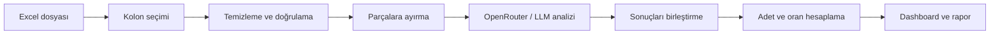
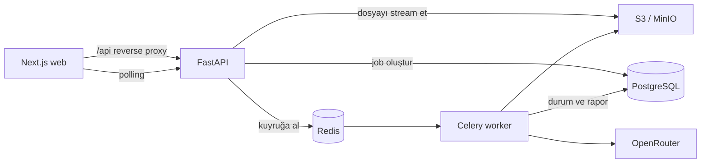

# AUZEF Chat Analiz

AUZEF Chat Analiz, büyük hacimli kullanıcı mesajlarında tekrar eden soruları ve ana konuları yapay zekâ desteğiyle ortaya çıkarmayı amaçlayan bir analiz uygulamasıdır.

Projenin ilk kullanım senaryosu, AUZEF chatbot mesajlarından gerçek kullanıcı ifadelerine dayalı sık sorulan sorular (SSS/FAQ) çıkarmaktır. Uygulama; Excel dosyasındaki mesajları temizlemeyi, benzer soruları gruplamayı, konu dağılımlarını hesaplamayı ve sonuçları anlaşılır bir dashboard üzerinde sunmayı hedefler.

> **Proje durumu:** Erken geliştirme aşamasındadır. Repoda şu anda Next.js tabanlı web uygulaması ve temel Docker çalışma ortamı bulunmaktadır. MVP mimarisi kararlaştırılmıştır; FastAPI backend, asenkron worker, veri katmanı ve analiz pipeline'ı henüz geliştirme planındadır.

## Neden bu proje?

Binlerce chatbot mesajını manuel olarak incelemek hem zaman alır hem de tekrar eden ihtiyaçların gözden kaçmasına neden olabilir. Bu proje, dağınık mesaj verisini aşağıdaki sorulara yanıt veren ölçülebilir bir rapora dönüştürmeyi amaçlar:

- Kullanıcılar en çok hangi soruları soruyor?
- Hangi konular daha sık gündeme geliyor?
- Bir soru veya tema toplam mesajların ne kadarını oluşturuyor?
- Chatbot bilgi tabanında hangi içerikler iyileştirilmeli?
- Zaman içinde kullanıcı ihtiyaçları nasıl değişiyor?

## Hedeflenen MVP akışı

1. Kullanıcı `.xlsx` formatındaki veri dosyasını yükler.
2. Dosyadaki kolonlar algılanır ve analiz edilecek metin kolonu seçilir.
3. OpenRouter API anahtarı güvenli biçimde backend'e iletilir; sürümlü sistem promptu backend tarafından yönetilir.
4. Boş, geçersiz veya analiz dışı kayıtlar temizlenir.
5. Büyük veri kümeleri modelin bağlam sınırlarına uygun parçalara ayrılır.
6. Mesajlar OpenRouter üzerinden seçilen dil modeline gönderilir.
7. Benzer sorular ve temalar birleştirilir; adet ve oranlar uygulama tarafından hesaplanır.
8. Sonuçlar dashboard ve özet rapor olarak gösterilir.



## Planlanan çıktılar

Dashboard üzerinde aşağıdaki bilgilerin sunulması planlanmaktadır:

- En sık sorulan sorular
- Ana konu ve tema grupları
- Her soru veya temanın tekrar adedi
- Toplam mesajlar içindeki yüzdesi
- Temaları temsil eden örnek kullanıcı mesajları
- Genel analiz özeti
- Toplam, işlenen, elenen ve geçersiz kayıt sayıları
- Dışa aktarılabilir FAQ ve analiz raporu

Örnek sonuç:

| Soru / tema                |  Adet |  Oran |
| -------------------------- | ----: | ----: |
| Sınav tarihleri            | 1.240 | %24,8 |
| Ders materyallerine erişim |   860 | %17,2 |
| Harç ve ödeme işlemleri    |   610 | %12,2 |
| Kayıt yenileme             |   480 |  %9,6 |

## Analiz yaklaşımı

LLM doğrudan toplam sayı üretmez. Her temizlenmiş veya benzersiz mesaj kimliğini kanonik bir SSS ya da tema kimliğine eşler. Adet, oran ve kayıt istatistikleri gerçek mesaj frekanslarından backend tarafından deterministik olarak hesaplanır. Böylece modelin sayı uydurma riski azaltılır ve sonuçlar izlenebilir kalır.

Analiz iki aşamalı bir map/reduce yaklaşımı izler:

1. Normalize edilen mesajlar exact hash ile tekilleştirilir; gerçek frekansları korunur.
2. Benzersiz kayıtlar token bütçesine göre parçalara ayrılır.
3. LLM, her kayıt kimliğini bir SSS veya tema kimliğine eşler.
4. Reduce aşaması farklı parçalardaki benzer kategorileri birleştirir.
5. Backend; adet, oran, Top N, özet ve uyarıları hesaplar.
6. Yapılandırılmış sonuç Pydantic/JSON Schema ile doğrulanır.

## Mimari

Yaklaşık 130 MB büyüklüğündeki gerçek Excel dosyalarının tek bir HTTP isteğinde güvenilir biçimde işlenemeyeceği kabul edilmiştir. Bu nedenle MVP, asenkron job/worker mimarisi kullanır. API uzun işlemi kuyruğa alarak `202 Accepted` döndürür; web arayüzü işlem durumunu 2–3 saniyede bir sorgular. İlk sürümde WebSocket veya SSE kullanılmaz.



### Bileşenler

| Bileşen       | Sorumluluk                                                                    |
| ------------- | ----------------------------------------------------------------------------- |
| Next.js web   | Dosya yükleme, sheet/kolon seçimi, ilerleme durumu ve dashboard               |
| FastAPI       | Upload ve analiz API'leri, doğrulama, job oluşturma ve güvenli hata cevapları |
| Celery worker | Excel profilleme, ön işleme, PII redaksiyonu ve LLM analiz pipeline'ı         |
| PostgreSQL    | Kalıcı job durumu, metadata, maliyet/token bilgisi ve JSONB analiz raporu     |
| Redis         | Celery kuyruğu, kısa süreli lock ve şifreli/TTL süreli OpenRouter anahtarı    |
| S3 / MinIO    | Ham upload ve Parquet ara dosyaları için geçici object storage                |

### İki aşamalı işlem modeli

**Upload ve profil:** Dosya object storage'a stream edilir; dosya türü ve OOXML yapısı doğrulanır. Sheet, kolon, satır, boş kayıt ve tekrar bilgileri çıkarılarak kullanıcıya seçim yaptırılır.

**Analiz:** Seçilen kolon satır satır okunur. PII maskelenir, mesajlar tekilleştirilir ve LLM ile sınıflandırılır. Sonuçlar backend'de birleştirilip doğrulandıktan sonra PostgreSQL'e rapor olarak kaydedilir.

Planlanan temel job akışı:

```text
queued → validating/preprocessing → analyzing → aggregating → completed
```

Terminal durumlar `failed` ve `cancelled` olarak tanımlanmıştır. Varsayılan analiz hard timeout'u 45 dakikadır ve ortam ayarıyla değiştirilebilir.

### Monorepo klasör yapısı

```text
AUZEF-Chat-Analiz/
├── apps/
│   ├── web/
│   │   ├── src/app/
│   │   ├── src/components/
│   │   ├── src/features/analysis/
│   │   └── src/lib/api/
│   └── backend/
│       ├── app/api/v1/
│       ├── app/core/
│       ├── app/domain/
│       ├── app/models/
│       ├── app/schemas/
│       ├── app/services/
│       ├── app/pipeline/
│       ├── app/workers/
│       └── app/prompts/faq_analysis/
├── tests/
│   ├── fixtures/
│   ├── integration/
│   └── e2e/
├── infra/
│   ├── docker/
│   └── scripts/
├── docs/
│   └── adr/0001-mvp-architecture.md
├── docker-compose.yml
├── Makefile
└── README.md
```

Backend API ve Celery worker aynı Python domain/pipeline kodunu paylaşır; ayrı mikroservis kod tabanları oluşturulmaz.

### Kesin veri akışı

```text
Browser
  → POST /uploads
  → FastAPI dosyayı stream ederek object storage'a yazar
  → Celery validate/profile job
  → güvenli .xlsx kontrolü + sheet/kolon/veri profili
  → kullanıcı sheet ve message_text kolonunu seçer
  → POST /analyses + X-OpenRouter-Key
  → API anahtarı AES-GCM ile şifrelenip Redis'e kısa TTL ile yazılır
  → Celery analysis job
  → preprocess + PII redaksiyonu + exact dedupe/frequency
  → token sınırına göre chunk
  → OpenRouter map çağrıları
  → kategori eşleme/reduce
  → backend deterministik adet/oran aggregation
  → Pydantic result validation
  → PostgreSQL JSONB report
  → GET /analyses/{id} polling
  → dashboard + export
```

#### Önemli analiz kararı

LLM doğrudan toplam sayı üretmez. Her temizlenmiş mesaj veya benzersiz mesaj kimliğini bir kanonik SSS ya da tema kimliğine eşler. Nihai adet ve oranları backend, mesajların gerçek frekanslarından deterministik olarak hesaplar. Böylece LLM'in sayı uydurması engellenir.

## Teknoloji yığını

### Frontend

- Next.js App Router, React ve strict TypeScript
- Tailwind CSS ve shadcn/ui
- TanStack Query
- React Hook Form ve Zod
- Recharts

### Backend ve veri işleme

- Python ve FastAPI
- Pydantic v2
- SQLAlchemy 2 ve Alembic
- Celery ve Redis
- PostgreSQL
- `openpyxl` (`read_only/data_only`), Polars ve PyArrow
- `httpx` ile OpenRouter entegrasyonu
- S3 uyumlu object storage; geliştirmede MinIO
- `uv` ile Python bağımlılık yönetimi

### Test ve kalite

- pytest ve pytest-asyncio
- Vitest ve React Testing Library
- Playwright
- Ruff, mypy, ESLint ve Prettier
- GitHub Actions

## Yerel geliştirme

### Gereksinimler

- Node.js 22 (önerilen)
- npm
- Tam MVP altyapısı eklendiğinde Docker ve Docker Compose

### Kurulum

Repoyu klonlayın:

```bash
git clone https://github.com/Emre-Ustundag/AUZEF-Chat-Analiz.git
cd AUZEF-Chat-Analiz
```

Bağımlılıkları yükleyin:

```bash
npm ci
```

Geliştirme sunucusunu başlatın:

```bash
npm run dev
```

Uygulamayı tarayıcıda [http://localhost:3000](http://localhost:3000) adresinden açabilirsiniz.

### Kullanılabilir komutlar

| Komut                  | Açıklama                                            |
| ---------------------- | --------------------------------------------------- |
| `npm run dev`          | Geliştirme sunucusunu başlatır                      |
| `npm run build`        | Üretim derlemesi oluşturur                          |
| `npm run start`        | Üretim sunucusunu başlatır                          |
| `npm run lint`         | ESLint kontrollerini çalıştırır                     |
| `npm run format`       | Desteklenen dosyaları Prettier ile biçimlendirir    |
| `npm run format:check` | Dosyaların format kurallarına uyduğunu kontrol eder |

## Docker ile çalıştırma

Mevcut Next.js uygulamasını production modunda derleyip başlatmak için:

```bash
docker compose up --build
```

Ardından [http://localhost:3000](http://localhost:3000) adresini açın.

Servisi durdurmak için:

```bash
docker compose down
```

Hedef MVP Docker Compose ortamı `web`, `api`, `worker`, `postgres`, `redis` ve `minio` servislerinden oluşacaktır. Bu servislerin tamamı henüz mevcut repo iskeletine eklenmemiştir.

## Güvenlik ve veri gizliliği

Proje gerçek kullanıcı mesajları ve haricî bir LLM servisiyle çalışacağı için aşağıdaki ilkeler MVP mimarisinin parçasıdır:

- Yalnızca `.xlsx` desteklenir; `.xls`, `.xlsm`, makrolu, şifreli veya bozuk dosyalar reddedilir.
- Varsayılan upload sınırı 150 MB, açılmış OOXML sınırı 1 GB ve satır sınırı 100.000'dir; bu değerler ortam ayarıdır.
- OpenRouter anahtarı yalnızca `X-OpenRouter-Key` header'ında taşınır ve loglarda redakte edilir.
- Anahtar PostgreSQL'e yazılmaz; AES-GCM ile şifrelenmiş, kısa ömürlü bir Redis kaydında tutulur ve işlem sonunda silinir.
- Telefon, e-posta, T.C. ve öğrenci numarası gibi bilinen PII desenleri LLM çağrısından önce maskelenir.
- Ham upload ve Parquet ara dosyaları işlem sonunda silinir; kaçak dosyalar için azami 24 saat lifecycle uygulanır.
- Model yalnızca backend whitelist'indeki structured-output destekli seçeneklerden seçilebilir.
- LLM çıktıları Pydantic/JSON Schema ile doğrulanır; sayısal sonuçlar modelden doğrudan kabul edilmez.
- Job başına maliyet sınırı LLM çağrıları başlamadan kontrol edilir.
- Gerçek kurum verisi kullanılmadan önce SSO/erişim kontrolü ve AUZEF veri işleme onayı zorunludur.

Geliştirme sırasında kullanılacak gizli değerler `.env` dosyalarında tutulmalı ve Git'e eklenmemelidir. Gerekli ortam değişkenleri entegrasyon geliştirildiğinde bu bölümde ayrıca belgelenecektir.

## Yol haritası

### MVP

- [ ] Excel dosyası yükleme ve doğrulama
- [ ] Metin kolonu algılama ve seçme
- [ ] Veri temizleme ve normalizasyon
- [ ] Büyük veri kümelerini parçalara ayırma
- [ ] OpenRouter entegrasyonu
- [ ] Sistem promptu ve analiz ayarları
- [ ] Benzer soruları ve temaları gruplama
- [ ] Adet ve oran hesaplama
- [ ] Analiz dashboard'u
- [ ] FAQ ve özet rapor dışa aktarma
- [ ] Hata yönetimi ve işlem durumu takibi
- [ ] FastAPI, Celery ve Redis job altyapısı
- [ ] PostgreSQL ve object storage entegrasyonu
- [ ] PII redaksiyonu ve veri saklama politikaları
- [ ] Backend, frontend ve uçtan uca test altyapısı

### Sonraki faz

- [ ] Instagram yorumlarını toplama
- [ ] Facebook yorumlarını toplama
- [ ] Kanal bazlı analiz
- [ ] Birleşik çok kanallı analiz
- [ ] Tarih aralığına göre karşılaştırma
- [ ] Tema eğilimleri ve dönemsel değişim analizi
- [ ] Kayıtlı analiz geçmişi ve rapor karşılaştırma

Hata bildirimleri ve özellik önerileri için [GitHub Issues](https://github.com/Emre-Ustundag/AUZEF-Chat-Analiz/issues) kullanılabilir.

## Katkıda bulunma

Branch adlandırma, kalite kontrolleri, pull request ve reviewer kuralları için [katkı rehberini](CONTRIBUTING.md) inceleyin. Pull request açıldığında standart kontrol listesi otomatik olarak gösterilir.

## Proje bağlantısı

[github.com/Emre-Ustundag/AUZEF-Chat-Analiz](https://github.com/Emre-Ustundag/AUZEF-Chat-Analiz)
