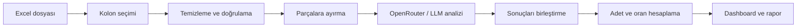

# AUZEF Chat Analiz

AUZEF Chat Analiz, büyük hacimli kullanıcı mesajlarında tekrar eden soruları ve ana konuları yapay zekâ desteğiyle ortaya çıkarmayı amaçlayan bir analiz uygulamasıdır.

Projenin ilk kullanım senaryosu, AUZEF chatbot mesajlarından gerçek kullanıcı ifadelerine dayalı sık sorulan sorular (SSS/FAQ) çıkarmaktır. Uygulama; Excel dosyasındaki mesajları temizlemeyi, benzer soruları gruplamayı, konu dağılımlarını hesaplamayı ve sonuçları anlaşılır bir dashboard üzerinde sunmayı hedefler.

> **Proje durumu:** Erken geliştirme aşamasındadır. Repoda şu anda Next.js tabanlı uygulama ve Docker çalışma ortamı bulunmaktadır. Dosya yükleme, Excel işleme, OpenRouter entegrasyonu ve analiz dashboard'u henüz geliştirme planındadır.

## Neden bu proje?

Binlerce chatbot mesajını manuel olarak incelemek hem zaman alır hem de tekrar eden ihtiyaçların gözden kaçmasına neden olabilir. Bu proje, dağınık mesaj verisini aşağıdaki sorulara yanıt veren ölçülebilir bir rapora dönüştürmeyi amaçlar:

- Kullanıcılar en çok hangi soruları soruyor?
- Hangi konular daha sık gündeme geliyor?
- Bir soru veya tema toplam mesajların ne kadarını oluşturuyor?
- Chatbot bilgi tabanında hangi içerikler iyileştirilmeli?
- Zaman içinde kullanıcı ihtiyaçları nasıl değişiyor?

## Hedeflenen MVP akışı

1. Kullanıcı `.xlsx` formatındaki veri dosyasını yükler.
2. Dosyadaki kolonlar algılanır ve analiz edilecek metin kolonu seçilir.
3. OpenRouter API anahtarı ile sistem promptu güvenli biçimde backend'e iletilir.
4. Boş, geçersiz veya analiz dışı kayıtlar temizlenir.
5. Büyük veri kümeleri modelin bağlam sınırlarına uygun parçalara ayrılır.
6. Mesajlar OpenRouter üzerinden seçilen dil modeline gönderilir.
7. Benzer sorular ve temalar birleştirilir; adet ve oranlar uygulama tarafından hesaplanır.
8. Sonuçlar dashboard ve özet rapor olarak gösterilir.



## Planlanan çıktılar

Dashboard üzerinde aşağıdaki bilgilerin sunulması planlanmaktadır:

- En sık sorulan sorular
- Ana konu ve tema grupları
- Her soru veya temanın tekrar adedi
- Toplam mesajlar içindeki yüzdesi
- Temaları temsil eden örnek kullanıcı mesajları
- Genel analiz özeti
- Toplam, işlenen, elenen ve geçersiz kayıt sayıları
- Dışa aktarılabilir FAQ ve analiz raporu

Örnek sonuç:

| Soru / tema | Adet | Oran |
| --- | ---: | ---: |
| Sınav tarihleri | 1.240 | %24,8 |
| Ders materyallerine erişim | 860 | %17,2 |
| Harç ve ödeme işlemleri | 610 | %12,2 |
| Kayıt yenileme | 480 | %9,6 |

## Analiz yaklaşımı

LLM; mesajların anlamını yorumlamak, benzer ifadeleri eşleştirmek ve temaları adlandırmak için kullanılacaktır. Adet, oran ve kayıt istatistikleri ise tutarlı ve doğrulanabilir sonuçlar elde etmek amacıyla backend tarafında programatik olarak hesaplanacaktır.

Büyük veri kümelerinde analiz şu iki aşamalı yaklaşımla yürütülebilir:

1. Her veri parçasından soru ve tema adaylarının çıkarılması
2. Parça sonuçlarının ortak bir sınıflandırma altında birleştirilmesi

Bu yaklaşım, modelin bağlam sınırlarını aşmadan yüksek hacimli verilerin işlenebilmesini sağlar.

## Teknoloji yığını

Mevcut proje altyapısı:

- [Next.js 16](https://nextjs.org/) — web uygulaması ve backend uçları
- [React 19](https://react.dev/) — kullanıcı arayüzü
- [TypeScript](https://www.typescriptlang.org/) — tip güvenli geliştirme
- [Tailwind CSS 4](https://tailwindcss.com/) — arayüz stilleri
- [Docker](https://www.docker.com/) — üretim ortamı ve dağıtım

MVP kapsamında eklenmesi planlanan temel entegrasyonlar:

- Excel (`.xlsx`) okuma ve doğrulama
- OpenRouter API üzerinden LLM erişimi
- Yapılandırılmış analiz çıktıları
- Dashboard grafikleri ve rapor dışa aktarma

## Yerel geliştirme

### Gereksinimler

- Node.js 22 (önerilen)
- npm

### Kurulum

Repoyu klonlayın:

```bash
git clone https://github.com/Emre-Ustundag/AUZEF-Chat-Analiz.git
cd AUZEF-Chat-Analiz
```

Bağımlılıkları yükleyin:

```bash
npm ci
```

Geliştirme sunucusunu başlatın:

```bash
npm run dev
```

Uygulamayı tarayıcıda [http://localhost:3000](http://localhost:3000) adresinden açabilirsiniz.

### Kullanılabilir komutlar

| Komut | Açıklama |
| --- | --- |
| `npm run dev` | Geliştirme sunucusunu başlatır |
| `npm run build` | Üretim derlemesi oluşturur |
| `npm run start` | Üretim sunucusunu başlatır |
| `npm run lint` | ESLint kontrollerini çalıştırır |

## Docker ile çalıştırma

Uygulamayı production modunda derleyip başlatmak için:

```bash
docker compose up --build
```

Ardından [http://localhost:3000](http://localhost:3000) adresini açın.

Servisi durdurmak için:

```bash
docker compose down
```

## Güvenlik ve veri gizliliği

Proje gerçek kullanıcı mesajları ve haricî bir LLM servisiyle çalışacağı için aşağıdaki ilkeler MVP'nin parçası olarak ele alınmalıdır:

- OpenRouter API anahtarı yalnızca backend tarafında kullanılmalıdır.
- API anahtarı tarayıcıya geri gönderilmemeli, loglanmamalı veya repoya kaydedilmemelidir.
- Yüklenen dosyalar yalnızca analiz için gereken süre boyunca tutulmalıdır.
- Kişisel veriler mümkün olduğunda LLM'e gönderilmeden önce maskelenmeli veya anonimleştirilmelidir.
- Dosya tipi, boyutu, kolon yapısı ve kayıt sayısı backend tarafında doğrulanmalıdır.
- LLM çıktıları güvenilir bir şema ile doğrulanmalı; sayısal sonuçlar model çıktısından doğrudan kabul edilmemelidir.
- Kullanılan model ve veri işleme politikaları kurumun KVKK gereksinimleriyle uyumlu olmalıdır.

Geliştirme sırasında kullanılacak gizli değerler `.env` dosyalarında tutulmalı ve Git'e eklenmemelidir. Gerekli ortam değişkenleri entegrasyon geliştirildiğinde bu bölümde ayrıca belgelenecektir.

## Yol haritası

### MVP

- [ ] Excel dosyası yükleme ve doğrulama
- [ ] Metin kolonu algılama ve seçme
- [ ] Veri temizleme ve normalizasyon
- [ ] Büyük veri kümelerini parçalara ayırma
- [ ] OpenRouter entegrasyonu
- [ ] Sistem promptu ve analiz ayarları
- [ ] Benzer soruları ve temaları gruplama
- [ ] Adet ve oran hesaplama
- [ ] Analiz dashboard'u
- [ ] FAQ ve özet rapor dışa aktarma
- [ ] Hata yönetimi ve işlem durumu takibi

### Sonraki faz

- [ ] Instagram yorumlarını toplama
- [ ] Facebook yorumlarını toplama
- [ ] Kanal bazlı analiz
- [ ] Birleşik çok kanallı analiz
- [ ] Tarih aralığına göre karşılaştırma
- [ ] Tema eğilimleri ve dönemsel değişim analizi
- [ ] Kayıtlı analiz geçmişi ve rapor karşılaştırma


Hata bildirimleri ve özellik önerileri için [GitHub Issues](https://github.com/Emre-Ustundag/AUZEF-Chat-Analiz/issues) kullanılabilir.

## Proje bağlantısı

[github.com/Emre-Ustundag/AUZEF-Chat-Analiz](https://github.com/Emre-Ustundag/AUZEF-Chat-Analiz)
